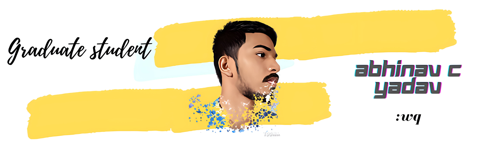

<!-- <h2 align='center'>Abhinav C Yadav @abhi-abhinav</h2>

<b>Graduate Student at St.Joseph Engineering College Mangaluru</b>
 -->

<h2>Namaste! 🙏</h2>

 

I'm Abhinav C Yadav!

 <i><b>Currently:</b> </i>
- 👯  CSE Student at SJEC Mangaluru.
- 🌱  Learning JavaScript
- 🔭  Working on my css skills 

<h2>👀 Stats</h2>

 

  <b><em>GitHub Stats:</em></b>  
       
  

<h2>📫 How to reach me:</h2>

<!-- This section you create this variables that are used above -->
[website]: http://abhi-abhinav.epizy.com
[twitter]: https://twitter.com/aabhinav__
[linkedin]: https://www.linkedin.com/in/abhinav-c-yadav-7427ab1aa/

<!---
abhi-abhinav/abhi-abhinav is a ✨ special ✨ repository because its `README.md` (this file) appears on your GitHub profile.
You can click the Preview link to take a look at your changes.
--->
